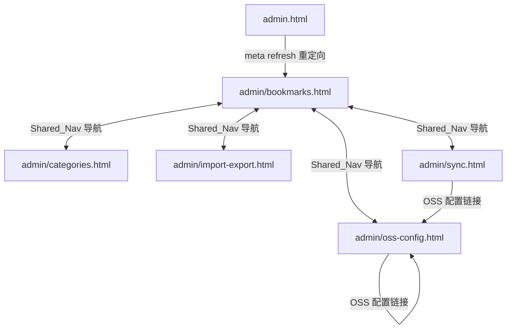

# 设计文档：admin-panel-split

## 概述

将现有的单页管理面板 `admin.html` 拆分为 5 个独立的 HTML 页面，统一放置在 `/admin/` 目录下。每个页面对应一个功能模块，共享统一的左侧导航栏，导航栏高亮当前所在页面。原 `admin.html` 替换为最小化重定向页面，保持向后兼容。

### 设计目标

- 每个功能模块拥有独立 URL，支持直接书签访问
- 所有页面共享一致的视觉风格和导航体验
- 零构建系统依赖，纯静态 HTML/CSS/JS 实现
- 最大化复用现有 `admin.js` 模块代码，不修改业务逻辑

---

## 架构

### 目录结构

```
/
├── admin.html                    # 重定向页（最小化，跳转至 /admin/bookmarks.html）
└── admin/
    ├── bookmarks.html            # 书签管理页
    ├── categories.html           # 分类管理页
    ├── import-export.html        # 导入/导出页
    ├── oss-config.html           # OSS 配置页
    └── sync.html                 # 同步状态页
```

### 页面关系



### 资源依赖关系

所有 `/admin/` 页面均从 `../assets/` 加载资源，与根目录的 `admin.html` 使用 `./assets/` 不同。

```
admin/bookmarks.html
  ├── ../assets/css/bootstrap.css
  ├── ../assets/css/admin.css
  ├── ../assets/css/fonts/linecons/css/linecons.css
  ├── ../assets/css/fonts/fontawesome/css/font-awesome.min.css
  ├── ../assets/js/jquery-1.11.1.min.js   (head 中加载)
  ├── ../assets/js/bootstrap.min.js
  ├── ../assets/js/app.js
  └── ../assets/js/admin.js
```

OSS 相关页面（`oss-config.html`、`sync.html`）额外加载：
```
https://gosspublic.alicdn.com/aliyun-oss-sdk-6.18.1.min.js
```

---

## 组件与接口

### Shared_Nav（共享导航组件）

每个页面内联相同的导航 HTML 结构，通过硬编码 `active` CSS 类区分当前页面。

**导航 HTML 结构模板：**

```html
<!-- 顶部导航栏 -->
<nav class="admin-navbar">
  <div class="admin-navbar-left">
    <a href="../index.html" class="admin-logo">
      
    </a>
    <span class="admin-title">管理面板</span>
  </div>
  <div class="admin-navbar-right">
    <a href="../index.html" class="admin-back-link">
      <i class="linecons-arrow-left"></i> 返回主页
    </a>
  </div>
</nav>

<!-- 左侧标签页导航 -->
<div class="admin-sidebar">
  <ul class="admin-tabs">
    <li class="admin-tab [active]"><a href="./bookmarks.html">📎 书签管理</a></li>
    <li class="admin-tab [active]"><a href="./categories.html">📚 分类管理</a></li>
    <li class="admin-tab [active]"><a href="./import-export.html">📦 导入/导出</a></li>
    <li class="admin-tab [active]"><a href="./oss-config.html">☁️ OSS 配置</a></li>
    <li class="admin-tab [active]"><a href="./sync.html">🔄 同步状态</a></li>
  </ul>
</div>
```

`[active]` 表示当前页面对应的 `<li>` 添加 `active` CSS 类，其余页面不添加。

**激活状态映射：**

| 页面文件 | active 导航项 |
|---------|-------------|
| `bookmarks.html` | 书签管理 |
| `categories.html` | 分类管理 |
| `import-export.html` | 导入/导出 |
| `oss-config.html` | OSS 配置 |
| `sync.html` | 同步状态 |

### 页面初始化脚本

每个页面在 `</body>` 前包含内联 `<script>` 块，调用对应模块的初始化方法：

| 页面 | 初始化调用 |
|-----|----------|
| `bookmarks.html` | `BookmarkManager.render(); BookmarkManager._bindEvents();` |
| `categories.html` | `CategoryManager.init();` |
| `import-export.html` | `ImportExport.init();` |
| `oss-config.html` | `OSSConfig.init();` |
| `sync.html` | `SyncManager.renderStatus(); SyncManager.init();` |

### SyncManager 跨页面导航适配

原 `admin.js` 中 `SyncManager.init()` 的 `#sync-goto-oss-config` 点击事件使用 Tab 切换逻辑（`$('.admin-tab[data-panel="panel-oss-config"]')`），拆分后需改为页面跳转。

**适配方案：** 在 `sync.html` 的内联初始化脚本中，覆盖该事件绑定：

```javascript
$(document).ready(function () {
    SyncManager.renderStatus();
    SyncManager.init();
    // 覆盖跨页面导航：跳转至 oss-config.html
    $('#sync-goto-oss-config').off('click').on('click', function (e) {
        e.preventDefault();
        window.location.href = './oss-config.html';
    });
});
```

### admin.html 重定向页

替换原 `admin.html` 为最小化重定向页面：

```html
<!DOCTYPE html>
<html lang="zh">
<head>
  <meta charset="utf-8">
  <meta http-equiv="refresh" content="0;url=./admin/bookmarks.html">
  <title>WebStack 管理面板</title>
</head>
<body>
  <script>window.location.replace('./admin/bookmarks.html');</script>
</body>
</html>
```

- `meta http-equiv="refresh"` 保证无 JS 环境下也能跳转
- `window.location.replace()` 保证有 JS 时立即跳转（不留历史记录）

---

## 数据模型

本功能为纯 HTML 页面拆分，不引入新的数据模型。所有数据模型沿用现有设计：

- **书签数据**：`localStorage` 中 `ws_private_data_<APP_VERSION>` 键，JSON 格式，结构见 `product.md`
- **OSS 配置**：`localStorage` 中 `ws_oss_config_<APP_VERSION>` 键，XOR 混淆后 base64 编码
- **同步配置**：`localStorage` 中 `ws_sync_config_<APP_VERSION>` 键，JSON 格式
- **激活数据源**：`localStorage` 中 `ws_active_source_<APP_VERSION>` 键，值为 `"default"` 或 `"private"`

所有 `localStorage` 操作均通过 `app.js` 中的 `wsKey()` 函数生成带版本后缀的 key，各页面共享同一 `APP_VERSION`，数据天然互通。

### 脚本加载顺序

```html
<!-- <head> 中 -->
<script src="../assets/js/jquery-1.11.1.min.js"></script>

<!-- </body> 前 -->
<script src="../assets/js/bootstrap.min.js"></script>
<script src="../assets/js/app.js"></script>
<script src="../assets/js/admin.js"></script>
<!-- OSS 页面额外加载（在 app.js 之前）: -->
<!-- <script src="https://gosspublic.alicdn.com/aliyun-oss-sdk-6.18.1.min.js"></script> -->
<script>
  $(document).ready(function () {
    // 页面专属初始化
  });
</script>
```

> **注意**：OSS SDK 需在 `app.js` 之前加载，因为 `app.js` 中的 `SyncManager.checkAndSync()` 依赖全局 `OSS` 构造函数。

---

## 正确性属性

经过 prework 分析，本功能的所有验收标准均属于 **SMOKE**（一次性配置/结构检查）或 **EXAMPLE**（具体场景验证）类型，不适合属性测试（PBT）。

原因分析：
- 本功能是纯静态 HTML 页面拆分，核心工作是将现有 HTML 结构复制到新文件并调整资源路径
- 所有验收标准都是"文件是否存在"、"路径是否正确"、"元素是否存在"等一次性检查
- 没有需要跨大量随机输入验证的业务逻辑（业务逻辑全部在 `admin.js` 中，本功能不修改）
- 行为不随输入变化，100 次迭代与 1 次迭代的验证价值相同

因此，本功能跳过 Correctness Properties 章节，采用 SMOKE 测试和 EXAMPLE 测试策略。

---

## 错误处理

### 资源路径错误

**风险**：`/admin/` 子目录下的页面若使用 `./assets/` 而非 `../assets/` 前缀，会导致 CSS/JS/图片 404。

**处理方案**：
- 所有本地资源引用统一使用 `../assets/` 前缀
- 图片路径（如 logo）同样使用 `../assets/images/` 前缀
- `admin.js` 中硬编码的 `./assets/data/default.json` 路径需在各页面的初始化脚本中通过 `$.ajaxSetup` 或直接在 `DataSourceManager.load()` 调用前确认路径正确

> **关键发现**：`admin.js` 中 `CategoryManager._switchSource()` 和 `DataSourceManager.load()` 内部使用 `./assets/data/default.json` 路径（相对于当前页面）。从 `/admin/` 目录访问时，该路径解析为 `/admin/assets/data/default.json`，会导致 404。
>
> **解决方案**：`app.js` 中的 `DataSourceManager.load()` 使用 `$.getJSON('./assets/data/default.json')`，从 `/admin/` 目录访问时路径错误。需要在各页面的内联脚本中，在初始化前修正路径，或在 `admin.js` 中将路径改为绝对路径 `/assets/data/default.json`。
>
> **推荐方案**：在各 `/admin/` 页面的内联初始化脚本中，通过覆盖 `DataSourceManager.load` 的 AJAX 路径，或直接在 `admin.js` 中将 `default.json` 路径改为 `../assets/data/default.json`（相对于 `/admin/` 目录）。考虑到 `admin.js` 只被 admin 页面使用，**直接修改 `admin.js` 中的路径为 `../assets/data/default.json`** 是最简洁的方案。同理，`BookmarkManager._openLogoPicker()` 中的 `./assets/data/logos-list.json` 也需修正。

### 跨页面导航兼容

**风险**：`admin.js` 中 `SyncManager.init()` 的 `#sync-goto-oss-config` 点击事件依赖 Tab 切换 DOM（`.admin-tab[data-panel="panel-oss-config"]`），拆分后该 DOM 不存在。

**处理方案**：在 `sync.html` 的内联脚本中覆盖该事件，改为 `window.location.href = './oss-config.html'`（见"组件与接口"章节）。

### 模块重复初始化

**风险**：`ImportExport`、`OSSConfig`、`SyncManager` 模块使用 `_initialized` 标志防止重复绑定事件。独立页面中每次加载都是全新环境，`_initialized` 始终为 `false`，不存在重复初始化问题。

---

## 测试策略

本功能不适合属性测试，采用以下测试策略：

### SMOKE 测试（结构验证）

通过浏览器手动验证或脚本静态分析：

1. **文件存在性**：确认 `/admin/` 目录下 5 个 HTML 文件均已创建
2. **资源路径**：检查每个页面所有 `src`/`href` 属性中的本地资源路径均以 `../assets/` 开头
3. **HTML 结构完整性**：每个页面包含 `<!DOCTYPE html>`、`<head>`、`<body>` 标签
4. **重定向逻辑**：`admin.html` 包含 `meta http-equiv="refresh"` 和 JS 跳转代码
5. **导航链接**：每个页面的导航栏包含 5 个相对路径链接
6. **CSS 引用**：每个页面 `<head>` 中引用 `admin.css`、`bootstrap.css` 及图标字体 CSS
7. **脚本引用**：每个页面引用 `jquery`、`bootstrap.min.js`、`app.js`、`admin.js`
8. **初始化调用**：每个页面的内联脚本包含对应模块的初始化调用

### EXAMPLE 测试（功能验证）

手动在浏览器中验证：

1. **导航激活状态**：访问每个页面，确认对应导航项高亮，其余 4 项不高亮
2. **脚本加载顺序**：检查 DevTools Network 面板，确认 jQuery → Bootstrap → app.js → admin.js 顺序
3. **OSS 页面脚本顺序**：`oss-config.html` 和 `sync.html` 中 OSS SDK 在 `app.js` 之前加载
4. **跨页面导航**：在 `sync.html` 点击"OSS 配置"链接，确认跳转至 `oss-config.html`

### 集成测试（端到端验证）

在浏览器中完整走通以下流程：

1. 访问 `admin.html`，确认自动跳转至 `admin/bookmarks.html`
2. 在书签管理页添加/编辑/删除书签，确认功能正常
3. 在分类管理页添加/重命名/删除分类，确认功能正常
4. 在导入/导出页导出 JSON，再导入，确认数据一致
5. 在 OSS 配置页填写配置并保存，确认配置持久化
6. 在同步状态页查看状态，确认数据正确显示
7. 在各页面之间切换，确认 `localStorage` 数据共享正常（数据源切换等）
